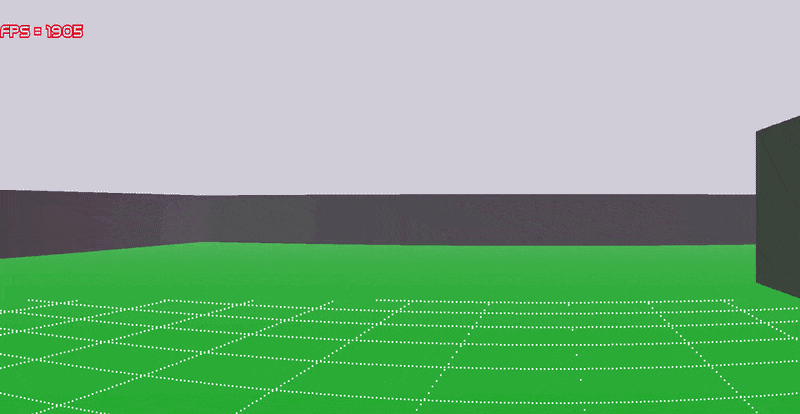
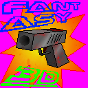

# *FANTASY3D*
### `#define bad closed_source_software`

Hello! This is my first C++ project with graphics.
It's a pseudo 3D engine. Uses raycasting technology to render.

## V0.05 REFACTORING + FPS LIMITER
* Heavily refactored `src/main.cpp` and a little bit in other files 
* Added code for limiting FPS in `src/main.cpp` in `class FPSManager`
* Target fps is loaded from `settings/global.txt`

### *Game icon:*

## Controls:
- W,A,S,D - movement
- Q,E - move up/down (only in cheater mode)
- ESC - lock/unlock cursor
- M - change player mode: cheater (flying and no clip) and default (only walk and jump)
- ENTER (in menu) - start game
- F3 - crash the game

## What libraries does it use?
1. SDL2
2. SDL2_ttf
3. cmath

**How to install needed libraries? (Ubuntu/Debian/Mint)**:  
`sudo apt update`  
`sudo apt install libsdl2-dev libsdl2-ttf-dev`

**How to build the executable (linux)**:  
`g++ -Wall -o "FANTASY3D" src/*.cpp -lSDL2 -lSDL2_ttf `
